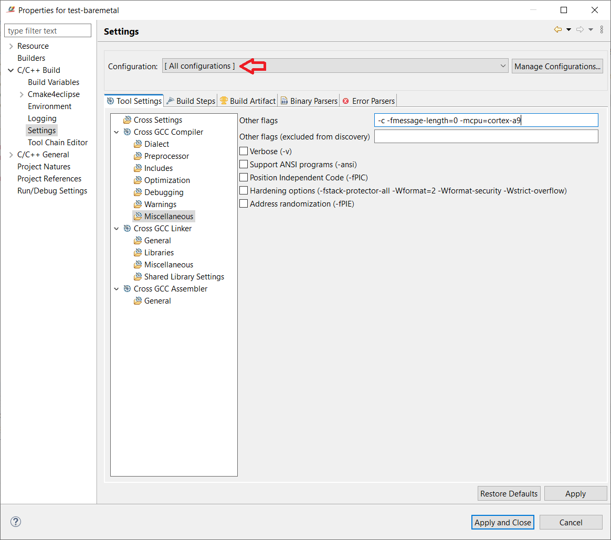
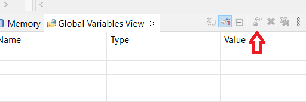
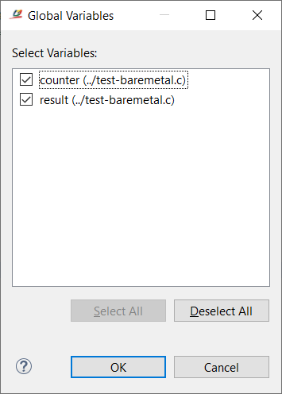

# Laboratorijska vježba 3

Cilj laboratorijske vježbe je da se studenti upoznaju sa izradom *bare-metal* aplikacije
na *embedded* platformi, kao i sa strukturom ELF fajla dobijenog nakon povezivanja
korišćenjem odgovarajuće linker skripte i postupkom njegovog učitavanja na ciljnu
platformu preko dostupnog JTAG interfejsa za debagovanje.

Nakon uspješno realizovane vježbe studenti će biti sposobni da:
1. konfigurišu i koriste *Ashling RiscFree IDE for Intel FPGAs* softversko razvojno okruženje
za razvoj i debagovanje *bare-metal* aplikacija bazirano na *Eclipse* okruženju,
2. prilagode linker skriptu u skladu sa ograničenjima ciljne platforme,
3. koriste *binutils* alate za inspekciju i interpretaciju izvršnog fajla u ELF formatu i
4. koriste JTAG interfejs prilikom debagovanja *bare-metal* aplikacije.

## Preduslovi za izradu vježbe

Za uspješno izvođenje laboratorijske vježbe potrebno je sljedeće:

- razvojna ploča *DE1-SoC* sa pripadajućim napajanjem i kablom za povezivanje računara sa
*USB Blaster* interfejsom na ploči,
- instaliran *Quartus Prime 23.1 Lite Edition* softver sa uključenim pratećim softverskim alatima
(*Ashling RiscFree IDE for Intel FPGAs* i alati za programiranje ploče sa pripadajućim drajverima) i
- instaliran ARM *toolchain* za kompajliranje *bare-metal* aplikacija.

## Instalacija neophodnog softvera

### Instalacija *Quartus Prime 24.1 Lite Edition* softvera

Instalacioni fajl za *Quartus Prime 24.1 Lite Edition* se može preuzeti sa
[zvaničnog linka](https://www.intel.com/content/www/us/en/software-kit/795188/intel-quartus-prime-lite-edition-design-software-version-23-1-for-windows.html)
kompanije *Intel*. Prilikom preuzimanja, izaberite operativni sistem (podržani su *Windows* i *Linux*) koji
koristite na svom računaru. Ukoliko koristite *Linux* na virtuelnoj mašini, preporučuje se da preuzmete
instalaciju za *Windows* ako je to *host* operativni sistem.

Kada preuzmete instalacioni fajl, instalacija je automatizovana i slična instalaciji drugih aplikacija.
Vodite računa da je potrebno da obavezno instalirate i prateće alate (*Ashling RiscFree IDE for Intel FPGAs* i
alat za programiranje ploče). Ukoliko ste u nedoumici oko izbora pojedinih opcija pri instalaciji,
posavjetujte se sa predmetnim asistentom ili nastavnikom.

> [!NOTE]
> Svi primjeri prikazani u nastavku su bazirani na *Windows* instalaciji *Quartus Prime 24.1 Lite Edition*
softverskog paketa, ali koraci i izgled korisničkog interfejsa je ekvivalentan i u *Linux* okruženju.

Podrazumijevana lokacija na kojoj će softver biti instaliran u *Windows* okruženju je `C:\intelFPGA_lite\23.1std`.
Iako ovo može da se redefiniše prilikom instalacije, najbolje je da zadržite preporučenu putanju za instalaciju.
U nastavku ćemo koristiti relativne putanje u odnosu na instalacioni folder *Quartus Prime* softvera, koji ćemo
referencirati sa `<QUARTUS_INSTALL_DIR>`.

### Instalacija ARM *toolchain*-a za kompajliranje *bare-metal* aplikacija

Prekompajliran *toolchain* za *bare-metal* aplikacije možemo preuzeti sa
[zvaničnog linka](https://developer.arm.com/downloads/-/arm-gnu-toolchain-downloads) kompanije ARM. Za ovu vježbu
ćemo koristiti verziju 13.2Rel1. U tom smislu, potrebno je da preuzmete *AArch32 bare-metal target (arm-none-eabi)*
varijantu.

Ako koristite *Windows*, potrebno je da preuzmete neki od fajlova iz *Windows (mingw-w64-i686) hosted cross toolchains*
sekcije (prikazano na slici). Postoje dvije opcije: (1) instalacioni fajl sa ekstenzijom `.exe` ili (2)
kompresovana arhiva sa ekstenzijom `.zip`. Pokretanjem instalacionog fajla pokrećete instalacioni program
koji sam raspakuje fajlove na definisanu lokaciju, dok kod druge opcije trebate ručno da raspakujete arhivu
i kopirate fajlove na željenu lokaciju.


U slučaju da koristite *Linux* na razvojnom računaru, preuzmite i raspakujte arhivu sa ekstenzijom `.tar.xz` u okviru
sekcije *x86_64 Linux hosted cross toolchains* (vidi sliku ispod).


Ovako preuzet *toolchain* potrebno je smjestiti/instalirati na lokaciju `<QUARTUS_INSTALL_DIR>/riscfree/toolchain/Arm`.

> [!IMPORTANT]
> S obzirom da *toolchain* sadrži korisne alate koje ćemo koristiti tokom vježbe, preporučujemo da
dodate putanju do `bin` foldera u sistemsku varijablu `Path` *Windows* okruženja. Alternativno, ako
koristite *Linux*, potrebno je da dodate ovu putanju u sistemsku varijablu `PATH`.

## Kreiranje projekta za jednostavnu *bare-metal* aplikaciju

Ukoliko to već niste uradili, povucite posljednje izmjene sa repozitorijuma

```
git checkout main
git pull
```

Pokrenite *Ashling RiscFree IDE for Intel FPGAs* iz menija. Prilikom prvog pokretanja, možda ćete morati da dozvolite
pristup softveru u okviru podešavanja *Firewall*-a kao što je prikazano na sljedećoj slici:


Nakon toga, pojaviće se prozor u kojem je potrebno odabrati putanju do radnog prostora, kao što je prikazano
na slici ispod.


U našen slučaju, potrebno je da, preko dugmeta *Browse*, odaberete putanju do foldera treće vježbe (`lab-03`),
a zatim da kliknete na *Launch*. Pojaviće se glavni prozor radnog okruženja koji će biti kao na sljedećoj slici.


Sada je potrebno da kreiramo projekat za našu testnu *bare-metal* aplikaciju. Prvo odaberemo opciju
**File**&rarr;**New**&rarr;**Project...** u glavnom meniju, nakon čega se pojavljuje prozor za izbor projekta.


Odaberemo *C/C++ Project* i kliknemo da dugme *Next*. U sljedećem prozoru definišemo šablon projekta.


U našem slučaju, potrebno je odabrati opciju *C Managed Build* i kliknuti na dugme *Next*. Sljedeći prozor
omogućava definisanje imena projekta (`test-baremetal`) i izbor polaznog kostura i *toolchain*-a. U datom
slučaju, biramo *Empty Project* kao tip i *Cross GCC* za *toolchain*, kao što je prikazano na sljedećoj
slici


> [!IMPORTANT]
> Vodite računa da naziv projekta bude `test-baremetal` (što je i naziv foldera u koji su smješteni izvorni
fajlovi projekta), kao i da je selektovana opcija *Use default location*. Na taj način biće automatski
odabrana ispravna lokacija projekta.

a zatim kliknemo na dugme *Next*. U sljedećem prozoru selektujemo obje podržane konfiguracije (*Debug* i
*Release*) i kliknemo dugme *Next*.


Konačno, potrebno je da definišemo prefiks i putanju do korišćenog *toolchain*-a.


Za naš *toolchain*, prefiks je `arm-none-eabi-`, a putanju selektujemo preko *Browse* dugmeta i
postavljamo na lokaciju `bin` foldera prethodno instaliranog *toolchain*-a. Nakon što smo sve podesili
kako treba, klikom na dugme *Finish* završavamo proces kreiranja projekta.

Prije kompajliranja projekta, potrebno je da konfigurišemo određene opcije za *toolchain*. U tom smislu
potrebno je desnim klikom miša na folder projekta odabrati opciju *Properties* iz padajućeg menija,
a zatim odabrati opciju **C/C++ Build**&rarr;**Settings**.

Prvo je potrebno da odaberete opciju *[ All configurations ]* u okviru *Configuration* polja kako bi izmjene
koje napravite bile primjenjene na obje konfiguracije (*Debug* i *Release*).

> [!NOTE]
> U okviru **Cross Settings** podešavanja možete da promijenite naziv prefiksa i putanje za *toolchain*, na primjer,
ako ste nešto pogrešno definisali pri kreiranju projekta ili ako želite da promijenite *toochain* u projektu.

U sekciji **Cross GCC Compiler**&rarr;**Miscellaneous**, u okviru polja *Other flags*, definišemo dodatne
kompajlerske flegove. U našem slučaju ćemo dodati `-mcpu=cortex-a9` kako bismo definisali tip procesora
(Cortex-A9) na ciljnoj platformi, kao što je ilustrovano na slici ispod.



U okviru sekcije **Cross GCC Linker**&rarr;**General** selektujemo opcije *Do not use standard start files (-nostartfiles)*
i *No startup or default libs (-nostdlib)* (vidi sliku). Ovo je potrebno jer ćemo u potpunosti da kontrolišemo proces
pokretanja sistema, a takođe nećemo koristiti standardnu biblioteku (čak ni u redukovanoj varijanti). Ovo
je tipično podešavanje za *bare-metal* aplikacije.


Zatim, u okviru sekcije **Cross GCC Linker**&rarr;**Miscellaneous**, podešavamo linkerske flegove. Kao i za
kompajler, postavljamo tip procesora, ali dodatno definišemo i skriptu koja će biti korišćena Prilikom
povezivanja korisničkih modula (opcija `-T../test.ld`). Sadržaj polja *Linker flags* sa ovim flegovima
prikazan je na sljedećoj slici.


Konačno, podešavamo tip procesora ta asemblerske flegove u sekciji **Cross GCC Assembler**&rarr;**General**
kao što je prikazano na slici.


Nakon što smo definisali željene opcije za *toolchain* potrebno je da ih sačuvamo klikom na dugme
*Apply and Close*, nakon čega će se pojaviti prozor kao na sljedećoj slici.


Klikom na dugme *Rebuild Index* omogućavamo da prethodne promjene budu ugrađene u naš projekat.

Sada je projekat spreman za kompajliranje i generisanje izvršnog fajla koji ćemo učitati na ciljnu
platformu. Međutim, prvo ćemo da analiziramo sadržaj linkerske skripte koja govori linkeru gdje
se smještaju pojedine sekcije objektnih fajlova.

Otvorite fajl `test.ld` koji predstavlja linkersku skriptu projekta. U prvoj liniji definisana je
organizacija memorije kako je dato ispod.

```
MEMORY
{
  program     (rx)  : ORIGIN = 0xffff0000, LENGTH = 16K
  data        (rw)  : ORIGIN = 0xffff4000, LENGTH = 16K
}
```

Kao što možemo da vidimo, imamo dva memorijska područja:

- `program` sa *read-only* pristupom (fleg `r`) i oznakom da sadrži instrukcije (fleg `x`),
čija je početna adresa `0xffff0000` (ovo je početna adresa *on-chip* SRAM memorije *Cyclone V*
platforme kapaciteta 64kB), a veličina 16kB;
- `data` koja ima pristup za čitanje i upis (flegovi `rw`) koja počinje od adrese `0xffff4000`
(odmah nakon 16kB `program` memorijskog područja) i takođe je veličine 16kB.

Nakon definisanja memorijskih područja slijedi definicija sekcija programa u okviru `SECTIONS`
segmenta linker skripte.

Prvo je definisana sekcija `.text`, koja sadrži instrukcije (sadržane unutar `.text` sekcija
ulaznih objektnih fajlova) i konstantne podatke (smještene unutar `.rodata` sekcija ulaznih
objektnih fajlova). Kao što može da se vidi iz isječka datog ispod, prvo se smještaju sve
`.text` ulazne sekcije, nakon kojih slijede `.rodata` sekcije. Ovako definisana izlazna sekcija
se smješta u memorijsko područje `program` (konstrukcija `> program` na kraju sekcije).

```
.text :
{
	*(.text*)
	*(.rodata*)
} > program
```

Sljedeća sekcija definiše neinicijalizovane globalne i statičke varijable (`.bss`) koji se
smještaju u `data` memorijsko područje, kao što je prikazano u sljedećem isječku.

```
.bss (NOLOAD) :
{
	__bss_start__ = .;
	*(.bss*)
	*(COMMON)
	__bss_end__ = .;
} > data
```

Ovdje skrećemo pažnju na nekoliko bitnih elemenata. Prvo, sekciju označavamo `NOLOAD` direktivom,
jer se radi o sekciji u koju nije predviđeno učitavanje podataka iz LMA područja koje sadrži
inicijalne vrijednosti (za razliku od sekcije sa inicijalizovanim podacima). Drugo, osim `.bss`
ulaznih sekcija, koje se prve smještaju, imamo i `COMMON` ulazne sekcije. Ove sekcije se mogu
automatski generisati prilikom kompajliranja i sadrže zajedničke simbole koji se tipično smještaju
unutar `.bss` sekcije. Konačno, ovdje definišemo i simbole `__bss_start__` i `__bss_end__` koji
označavaju početak i kraj `.bss` sekcije. Ovi simboli se eksportuju od strane linkera, tako da su
globalno vidljivi i mogu se korsititi za pristup ovoj sekciji iz programa ako je to potrebno
(npr. za postavljanje neinicijalizovanih podataka na nulu pri startovanju sistema).

Sljedeća sekcija je `.data` koja sadrži inicijalizovane globalne i statičke varijable. Ova sekcija
se takođe nalazi u `data` memorijskom području.

```
.data :
{
	__data_start__ = .;
	*(.data*);
	__data_end__ = .;
} > data
```

Kao što vidimo u prethodnom isječku, ova sekcija sadrži sve `.data` ulazne sekcije. Slično kao
kod `.bss` sekcije, definišemo simbole koji označavaju početak (`__data_start__`) i kraj
(`__data_end__`) ove sekcije.

Posljednja sekcija koju definišemo je sekcija rezervisana za stek memoriju (`.stack`). Ovo je
takođe `NOLOAD` sekcija, koja treba da ima poravnanje `ALIGN(8)` za datu arhitekturu.

```
.stack (NOLOAD):
{
	. = ALIGN(8);
	. = . + __stack_size;
	. = ALIGN(8);
	__stack_start__ = .;
} > data
```

Iz datog isječka vidimo da je veličina stek memorije određena je simbolom `__stak_size` čiju
vrijednost smo ranije definisali tako da iznosi 8kB:

`__stack_size = 0x2000;`

Na kraju stek sekcije, definišemo simbol `__stack_start__` koji odgovara adresi vrha steka.
Ovaj simbol koristimo u inicijalizacionom kodu za postavljanje početne vrijednosti `SP` registra.

Konačno, na kraju linker skripte definišemo simbol `_end` koji označava posljednju lokaciju
korišćene memorije.

`_end = . ;`

S obzirom da smo postavili opcije `-nostartfiles` i `-nostdlib` prilikom konfigurisanja linkera,
naša aplikacija ne sadrži podrazumijevani *startup* kod, pa je potrebno da ga dodamo. Iz tog
razloga se u projektu nalazi i minimalan *startup* kod napisan u asemblerskom jeziku (fajl
`startup.S`). Ovaj kod sadrži samo nekoliko instrukcija, kao što je prikazano u isječku ispod.

```assembly
_start:
	ldr     r1, =__stack_start__
	mov sp,r1
	bl main
	b .
```

Uloga ovog koda je da postavi pokazivač vrha steka (registar `SP`) na vrijednost definisanu u
linker skripti (simbol `__stack_start__`). Ovo je neophodno jer pozivi svih funkcija u C programu
zavise od ispravno definisanog steka.

Nakon postavljanja `SP` registra, imamo bezuslovni skok na simbol `main` (instrukcija `bl main`)
koji predstavlja *main* funkciju naše aplikacije.

> [!NOTE]
> Nakon instrukcije skoka na simbol `main`, slijedi instrukcija `b .` koja predstavlja beskonačnu
petlju. Ova instrukcija nije neophodna u našem slučaju, jer C program već sadrži beskonačnu petlju.
Međutim, dobra je praksa da se doda ova funkcija u inicijalizacioni kod za slučaj da se izađe iz
*main* funkcije glavnog programa, kako bi se dalje izvršavanje zadržalo u definisanom području.
U suprotnom, procesor bi nastavio da izvršava podatke koji slijede kao instrukcije, što dovodi do
nepredvidivog ponašanja sistema.

Sada konačno možemo da kompajliramo našu aplikaciju. Prvo desnim klikom na folder projekta iz
padajućeg menija biramo opciju **Build Configurations**&rarr;**Set Active**&rarr;**Debug** da
bismo odabrali konfiguraciju koja uključuje simbole potrebne za debagovanje, a zatim
kompajliramo projekat desnim klikom na folder projekta i izborom opcije **Build Project** iz
padajućeg menija.

> [!IMPORTANT]
> Ukoliko promijenimo linker skriptu i pokrenemo kompajliranje projekta, dobićemo poruku da nije
ništa promijenjeno. To je zbog toga što se linker skripta ne vidi kao fajl sa izvornim kodom, pa
se izmjene ignorišu od strane *build* sistema. Da bi ove promjene bile aktuelizovane u izvršnom
fajlu, potrebno je prvo da očistimo projekat izborom opcije **Clean Project** iz padajućeg menija.

Kompajliranjem dobijamo izvršni fajl u ELF formatu koji se smješta u *Debug* folder unutar projekta.
Prije izvršavanja samog programa, prvo ćemo se upoznati sa strukturom ovog fajla. U tu svrhu nam
služi `objdump` alatka. Ako pređemo u `Debug` folder i izvršimo komandu

```
arm-none-eabi-objdump -h test-baremetal
```

dobijamo ispis koji prikazuje listu sekcija programa.

```
test-baremetal:     file format elf32-littlearm

Sections:
Idx Name          Size      VMA       LMA       File off  Algn
  0 .text         000000c4  ffff0000  ffff0000  00001000  2**2
                  CONTENTS, ALLOC, LOAD, READONLY, CODE
  1 .bss          00000008  ffff4000  ffff4000  00002000  2**2
                  ALLOC
  2 .stack        00002000  ffff4008  ffff4008  00002000  2**0
                  ALLOC
  3 .ARM.attributes 00000035  00000000  00000000  000010c4  2**0
                  CONTENTS, READONLY
  4 .comment      00000044  00000000  00000000  000010f9  2**0
                  CONTENTS, READONLY
  5 .debug_info   0000007f  00000000  00000000  0000113d  2**0
                  CONTENTS, READONLY, DEBUGGING, OCTETS
  6 .debug_abbrev 00000064  00000000  00000000  000011bc  2**0
                  CONTENTS, READONLY, DEBUGGING, OCTETS
  7 .debug_aranges 00000020  00000000  00000000  00001220  2**0
                  CONTENTS, READONLY, DEBUGGING, OCTETS
  8 .debug_macro  00000ad7  00000000  00000000  00001240  2**0
                  CONTENTS, READONLY, DEBUGGING, OCTETS
  9 .debug_line   00000068  00000000  00000000  00001d17  2**0
                  CONTENTS, READONLY, DEBUGGING, OCTETS
 10 .debug_str    00002e02  00000000  00000000  00001d7f  2**0
                  CONTENTS, READONLY, DEBUGGING, OCTETS
 11 .debug_frame  00000028  00000000  00000000  00004b84  2**2
                  CONTENTS, READONLY, DEBUGGING, OCTETS
```

Iz ovog ispisa vidimo da program ima tri sekcije (ako izuzmemo sekcije koje sadrže simbole
neophodne za debagovanje):

- `.text` koja sadrži instrukcije i konstante, čija veličina je `0xc4` i koja počinje od
adrese `0xffff0000` (početak `program` memorijskog područja);
- `.bss` koja sadrži neinicijalizovane globalne i statičke varijable, čija je veličina `0x8`
i koja počinje od adrese `0xffff4000` (početak `data` memorijskog područja);
- `.stack` koja predstavlja stek memoriju, veličine je `0x2000` i čija je početna adresa
`0xffff4008` (kraj `.bss` sekcije sa poravnanjem `ALIGN(8)).

Prvo što treba primjetiti da nema `.data` sekcije iako u programu imamo inicijalizovanu globalnu
varijablu `counter`. Razlog je u tome što je varijabla inicijalizovana na 0, pa će kompajler
smjestiti i ovu varijablu u `.bss` sekciju sa ostalim varijablama koje bi inicijalno trebalo da
se postave na 0. To možemo potvrditi ako izlistamo sekcije objektnog fajla `test-baremetal.o`
korišćenjem komande `arm-none-eabi-objdump -h test-baremetal.o`.

```
test-baremetal.o:     file format elf32-littlearm

Sections:
Idx Name          Size      VMA       LMA       File off  Algn
  0 .group        0000000c  00000000  00000000  00000034  2**2
                  CONTENTS, READONLY, GROUP, LINK_ONCE_DISCARD
  1 .text         000000b0  00000000  00000000  00000040  2**2
                  CONTENTS, ALLOC, LOAD, RELOC, READONLY, CODE
  2 .data         00000000  00000000  00000000  000000f0  2**0
                  CONTENTS, ALLOC, LOAD, DATA
  3 .bss          00000008  00000000  00000000  000000f0  2**2
                  ALLOC
  4 .debug_info   0000007f  00000000  00000000  000000f0  2**0
                  CONTENTS, RELOC, READONLY, DEBUGGING, OCTETS
  5 .debug_abbrev 00000064  00000000  00000000  0000016f  2**0
                  CONTENTS, READONLY, DEBUGGING, OCTETS
  6 .debug_aranges 00000020  00000000  00000000  000001d3  2**0
                  CONTENTS, RELOC, READONLY, DEBUGGING, OCTETS
  7 .debug_macro  00000011  00000000  00000000  000001f3  2**0
                  CONTENTS, RELOC, READONLY, DEBUGGING, OCTETS
  8 .debug_macro  00000ac6  00000000  00000000  00000204  2**0
                  CONTENTS, RELOC, READONLY, DEBUGGING, OCTETS
  9 .debug_line   00000068  00000000  00000000  00000cca  2**0
                  CONTENTS, RELOC, READONLY, DEBUGGING, OCTETS
 10 .debug_str    00002e02  00000000  00000000  00000d32  2**0
                  CONTENTS, READONLY, DEBUGGING, OCTETS
 11 .comment      00000045  00000000  00000000  00003b34  2**0
                  CONTENTS, READONLY
 12 .debug_frame  00000028  00000000  00000000  00003b7c  2**2
                  CONTENTS, RELOC, READONLY, DEBUGGING, OCTETS
 13 .ARM.attributes 00000033  00000000  00000000  00003ba4  2**0
                  CONTENTS, READONLY
```

Kao što možemo da vidimo, sekcija `.data` postoji ali je njena veličina 0, pa se ne smješta
u izlazni fajl. Da smo imali neku varijablu čija je inicijalna vrijednost različita od 0, ona
bi bila smještena u ovu sekciju. Ovo možemo potvrditi definisanjem statičke varijable u
programu, npr. `static int sum = 10` nakon `int b = 5`. Ako ako nakon kompajliranja ponovo
izlistamo sekcije programa, dobijamo

```
test-baremetal:     file format elf32-littlearm

Sections:
Idx Name          Size      VMA       LMA       File off  Algn
  0 .text         000000c4  ffff0000  ffff0000  00001000  2**2
                  CONTENTS, ALLOC, LOAD, READONLY, CODE
  1 .bss          00000008  ffff4000  ffff4000  00002000  2**2
                  ALLOC
  2 .data         00000004  ffff4008  ffff4008  00002008  2**2
                  CONTENTS, ALLOC, LOAD, DATA
  3 .stack        00002004  ffff400c  ffff400c  0000200c  2**0
                  ALLOC
  4 .ARM.attributes 00000035  00000000  00000000  0000200c  2**0
                  CONTENTS, READONLY
  5 .comment      00000044  00000000  00000000  00002041  2**0
                  CONTENTS, READONLY
  6 .debug_info   0000008c  00000000  00000000  00002085  2**0
                  CONTENTS, READONLY, DEBUGGING, OCTETS
  7 .debug_abbrev 00000075  00000000  00000000  00002111  2**0
                  CONTENTS, READONLY, DEBUGGING, OCTETS
  8 .debug_aranges 00000020  00000000  00000000  00002186  2**0
                  CONTENTS, READONLY, DEBUGGING, OCTETS
  9 .debug_macro  00000ad7  00000000  00000000  000021a6  2**0
                  CONTENTS, READONLY, DEBUGGING, OCTETS
 10 .debug_line   00000068  00000000  00000000  00002c7d  2**0
                  CONTENTS, READONLY, DEBUGGING, OCTETS
 11 .debug_str    00002e02  00000000  00000000  00002ce5  2**0
                  CONTENTS, READONLY, DEBUGGING, OCTETS
 12 .debug_frame  00000028  00000000  00000000  00005ae8  2**2
                  CONTENTS, READONLY, DEBUGGING, OCTETS
```

odakle vidimo da je kreirana `.data` sekcija veličine `0x4`. Komandom
`arm-none-eabi-objdump -t test-baremetal` prikazujemo tabelu simbola

```
test-baremetal:     file format elf32-littlearm

SYMBOL TABLE:
ffff0000 l    d  .text  00000000 .text
ffff4000 l    d  .bss   00000000 .bss
ffff4008 l    d  .data  00000000 .data
ffff400c l    d  .stack 00000000 .stack
00000000 l    d  .ARM.attributes        00000000 .ARM.attributes
00000000 l    d  .comment       00000000 .comment
00000000 l    d  .debug_info    00000000 .debug_info
00000000 l    d  .debug_abbrev  00000000 .debug_abbrev
00000000 l    d  .debug_aranges 00000000 .debug_aranges
00000000 l    d  .debug_macro   00000000 .debug_macro
00000000 l    d  .debug_line    00000000 .debug_line
00000000 l    d  .debug_str     00000000 .debug_str
00000000 l    d  .debug_frame   00000000 .debug_frame
00000000 l    df *ABS*  00000000 startup.o
ffff0000 l       .text  00000000 _start
00000000 l    df *ABS*  00000000 test-baremetal.c
ffff4008 l     O .data  00000004 sum.0
ffff4008 g       .data  00000000 __data_start__
00002000 g       *ABS*  00000000 __stack_size
ffff4000 g       .bss   00000000 __bss_start__
ffff400c g       .data  00000000 __data_end__
ffff4008 g       .bss   00000000 __bss_end__
ffff4000 g     O .bss   00000004 counter
ffff0014 g     F .text  000000b0 main
ffff4004 g     O .bss   00000004 result
ffff6010 g       .stack 00000000 _end
ffff6010 g       .stack 00000000 __stack_start__
```

iz koje se jasno vidi da se varijabla `sum` nalazi u `.data` sekciji.

> [!TIP]
> Lista simbola u kompaktnijoj formi može se prikazati komandom `arm-none-eabi-nm test-baremetal`.

Ono što možemo primjetiti u prikazu liste sekcija iz prethodnog slučaja je da je VMA i LMA
adrese sekcije `.data` imaju istu vrijednost, što znači da nije definisano odakle se učitavaju
inicijalne vrijednosti varijabli koje se nalaze u sekciji. Ovo možemo ispraviti ako kraj sekcije
izmjenimo tako da bude `> data AT > program` umjesto `> data`. Na ovaj način govorimo linkeru
da se inicijalne vrijednosti učitavaju iz `program` memorijskog područja.

Ako ponovo prekompajliramo projekat (prethodno moramo da ga očistimo, jer smo napravili izmjene
samo u linker skripti) i ponovo izlistamo sekcije, dobijamo

```
test-baremetal:     file format elf32-littlearm

Sections:
Idx Name          Size      VMA       LMA       File off  Algn
  0 .text         000000c4  ffff0000  ffff0000  00001000  2**2
                  CONTENTS, ALLOC, LOAD, READONLY, CODE
  1 .bss          00000008  ffff4000  ffff4000  00003000  2**2
                  ALLOC
  2 .data         00000004  ffff4008  ffff00c4  00002008  2**2
                  CONTENTS, ALLOC, LOAD, DATA
  3 .stack        00002004  ffff400c  ffff00c8  0000200c  2**0
                  ALLOC
  4 .ARM.attributes 00000035  00000000  00000000  0000200c  2**0
                  CONTENTS, READONLY
  5 .comment      00000044  00000000  00000000  00002041  2**0
                  CONTENTS, READONLY
  6 .debug_info   0000008c  00000000  00000000  00002085  2**0
                  CONTENTS, READONLY, DEBUGGING, OCTETS
  7 .debug_abbrev 00000075  00000000  00000000  00002111  2**0
                  CONTENTS, READONLY, DEBUGGING, OCTETS
  8 .debug_aranges 00000020  00000000  00000000  00002186  2**0
                  CONTENTS, READONLY, DEBUGGING, OCTETS
  9 .debug_macro  00000ad7  00000000  00000000  000021a6  2**0
                  CONTENTS, READONLY, DEBUGGING, OCTETS
 10 .debug_line   00000068  00000000  00000000  00002c7d  2**0
                  CONTENTS, READONLY, DEBUGGING, OCTETS
 11 .debug_str    00002e01  00000000  00000000  00002ce5  2**0
                  CONTENTS, READONLY, DEBUGGING, OCTETS
 12 .debug_frame  00000028  00000000  00000000  00005ae8  2**2
                  CONTENTS, READONLY, DEBUGGING, OCTETS
```

Odavde jasno vidimo da je vrijednost LMA sada `0xffff00c4` koja se nalazi u `program`
memorijskom području.

> [!IMPORTANT]
> Kao što ćemo vidjeti, prethodna intervencija u linker skripti nije dovoljna da incijalne
vrijednosti budu postavljene kako treba. Za tako nešto je potrebno proširiti *startup* kod
koji će da prekopira vrijednosti sa LMA na VMA adresu sekcije (slično, varijable `.bss` u sekciji
je potrebno inicijalno postaviti na 0). U tu svrhu se mogu iskoristiti simboli definisani u
linker skripti koji označavaju početak i kraj sekcije.

Sada ćemo da pokrenemo izvršavanje programa korišćenjem JTAG interfejsa za debagovanje. Prvo
povežite *DE1-SoC* ploču sa napajanjem i razvojni računar USB kablom sa *USB Blaster* interfejsom
za programiranje i debagovanje, kao što je prikazano na slici ispod.

Uključite napajanje ploče i pokrenite izvršavanje u *Debug* modu tako što ćete desnim klikom
na folder projekta iz padajućeg menija izabrati opciju **Debug As**&rarr;**Ashling Arm Hardware Debugging**.
Pojaviće se prozor za izbor i konfiguraciju interfejsa za debagovanje kao na slici ispod.


U polju *Debug probe* trebalo bi da se nalazi *DE-SoC [USB-1]*. Ukoliko to nije slučaj, provjerite
da je napajanje ploče uključeno i kliknite na *Refresh* dugme s desne strane. Zatim u sekciji
*Target Configuration* kliknite na *Auto-detect Scan Chain* za detekciju uređaja. Konačno, kliknite
dugme *Debug* koje će biti omogućeno nakon detekcije. Pojaviće se prozor sa sljedeće slike.


U ovom prozoru kliknite na dugme *Switch* da se prebacite u *Debug* perspektivu nakon čega će
program da se učita u memoriju i možete početi sa debagovanjem.

Alternativno, izvršavanje u *debug* modu može da se pokrene klikom na dugme za debagovanje u
paleti sa alatkama koja je prikazana na slici ispod.


Dugme *Run* iz ove palete se tipično koristi za izvršavanje programa koji su kompajlirani sa
*Release* konfiguracijom.

Nakon pokretanja, program će automatski da se zaustavi na početku *main* funkcije, a korisnik
može da izvrši inspekciju različitih objekata programa u nizu prozora koji su mu na raspolaganju
u okviru softverskog okruženja. Jedan od takvih prozora je *Variables*, koji prikazuje trenutno
stanje lokalnih varijabli (vidi sliku ispod). Ukoliko ne vidite ovaj prozor, trebate ga omogućiti
opcijom **Window**&rarr;**Show View**&rarr;**Variables** iz glavnog menija.


Inicijalno, lokalne varijable (`a` i `b`) će imati neke slučajne vrijednosti. Međutim, kako
izvršavanje programa napreduje, ove varijable će biti postavljene na očekivane vrijednosti
nakon što se izvrše instrukcije za njihovu inicijalizaciju.

Program možemo izvršavati korak po korak ili tako da se izvršava do sljedeće prekidne tačke. U
tom smislu možemo da koristimo paletu alatki za kontrolu izvršavanja programa prikazanu na slici.


Najznačajnije opcije za kontrolu izvršavanja programa su:

1. *Resume* kojom nastavljamo izvršavanje programa koji je zaustavljen u nekoj prekidnoj tački
(aktivno samo dok je suspendovano izvršavanje programa),
2. *Suspend* kojom pauziramo izvršavanje programa (aktivno samo dok se program izvršava),
3. *Terminate* za prekidanje izvršavanja programa i izlazak iz *Debug* moda,
4. *Step Into* za izvršavanje instrukcija korak po korak na način da se pri nailasku na poziv
funkcije izvršavanje nastavlja korak po korak i unutar funkcije i
5. *Step Over* za izvršavanje instrukcija korak po korak, pri čemu se po nailasku na poziv
funkcije izvršava kompletna funkcija i vraća rezultat, tj. funkcija se tretira kao jedna atomska
instrukcija.

Sada koristite opciju *Step Into* da izvršite prve dvije instrukcije (inicijalizacija varijabli
`a` i `b`). Kao rezultat, u prozoru varijabli će da se promijeni stanje varijabli, kao što je
ilustrovano na sljedećoj slici.


Sada, prije nego što izvršite instrukciju za inicijalizaciju globalne varijable `result`, prikažite
prozor globalnih varijabli tako što ćete odabrati opciju **Window**&rarr;**Show View**&rarr;**Other...**,
a zatim u prikazanom prozoru odabrati opciju **Debug**&rarr;**Global Variables View** (vidi sliku).


Da bi prikazali globalne varijable, potrebno je prikazati prozor za dodavanje globalnih varijabli
koji se aktivira klikom na dugme prikazano na slici ispod.



U prikazanom prozoru odaberemo željene varijable i kliknemo na dugme *OK*, kao što je ilustrovano
na sljedećoj slici.



Inicijalno, varijable će imati slučajne vrijednosti (vidi sliku ispod), jer ih *startup* kod
nije postavio na 0, odnosno nije kopirao inicijalne vrijednosti iz `program` memorijskog područja.


Međutim, kada se njihova vrijednost promijeni u kodu (npr. izvršavanjem naredne instrukcije
opcijom *Step Into*), to se automatski reflektuje u prikazanom prozoru. Na sljedećoj slici
vidimo da se varijablа `result` postavlja na 0.


Postavite sada prekidnu tačku na liniju sa instrukcijom dodjele nove vrijednosti `result`
unutar beskonačne petlje kao što je prikazano na datoj slici.


Zatim pokrenite izvršavanje programa do sljedeće prekidne tačke (opcija *Resume* iz palete
sa alatkama). Izvršavanje programa će da se zaustavi u prethodno definisanoj prekidnoj tački,
a globalna varijabla `counter` će takođe da promijeni vrijednosti kako je dato na slici ispod.


Eksperimentišite sa izvršavanjem programa na ovaj način i pratite kako se mijenjaju vrijednosti
lokalnih i globalnih varijabli nakon svakog zasutavljanja u prekidnoj tački.

Statičku varijablu `sum` možemo posmatrati u okviru prozora *Expressions* tako što ćemo
kliknuti na polje *Add new expression* i unijeti naziv varijable.

Iz prethodne analize izvršavanja programa, jasno je da inicijalne vrijednosti posmatranih
globalnih i statičkih varijabli ne odgovaraju onim koje su postavljene u programu. Da bi ovo
ispravili, moramo da modifikujemo *startup* kod.

Ispod je data modifikacija fajla `startup.S` na način da se prvo inicijalizuje `.data` sekcija,
nakon čega slijedi postavljanje svih varijabli unutar `.bss` sekcije na 0. Konačno, prelazi se
na prethodni segment koda za inicijalizaciju `SP` registra, čime je proces incijalizacije
kompletiran.

```
_start:
	/* Initialize .data section */
    ldr r0, =__text_end__
    ldr r1, =__data_start__
    ldr r2, =__data_end__
    sub r3, r2, r1

    /* Handle the case when .data section size is 0 */
    cmp r3, #0
    beq init_bss

copy_data:
    ldrb r4, [r0], #1
    strb r4, [r1], #1
    subs r3, r3, #1
    bne copy_data

init_bss:
    /* Initialize .bss section  */
    ldr r0, =__bss_start__
    ldr r1, =__bss_end__
    sub r2, r1, r0

	/* Handle the case when .bss section size is 0 */
    cmp r2, #0
    beq init_stack
    mov r4, #0

zero_bss:
    strb r4, [r0], #1
    subs r2, r2, #1
    bne zero_bss

init_stack:
	ldr r1, =__stack_start__
	mov sp, r1
	bl main
	b .
```

U okviru prethodnog asemblerskog programa se koriste simboli koji određuju početak i kraj
sekcija definisanih u linker skripti. Jedini simbol koji nedostaje u ovoj skripti je `__text_end__`
koji označava lokaciju od koje se nalaze inicijalne vrijednosti varijabli unutar `.data`
sekcije (kraj `.text` sekcije), odnosno LMA adresu sekcije. Ovu adresu možete pribaviti
korišćenjem direktive `LOADADDR` ili korišćenjem operatora `.` na kraju `.text` sekcije.

Sada modifikujte *startup* kod korišćenjem asemblerskog programa datog iznad i dodajte
nedostajuće simbole u linker skripti, a zatim ponovo kompajlirajte program i učitajte
korišćenjem JTAG interfejsa za debagovanje. Potvrdite da inicijalne vrijednosti statičkih i
globalnih varijabli sada imaju očekivane vrijednosti.

Po završetku ovog dijela vježbe, predajte sve modifikacije na prethodno kreiranu granu
za treću vježbu u repozitorijumu.

## *Hello World* aplikacija za *embedded* sisteme: *LED Blinking*


Na kraju, predajte sve modifikacije na granu vježbe u repozitorijumu.
