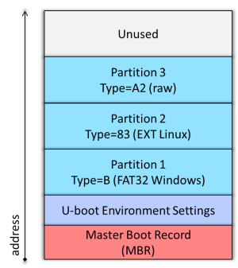

# Laboratorijska vježba 4

Cilj laboratorijske vježbe je da se studenti upoznaju sa konfiguracijom, kroskompajliranjem i
osnovnim komandama pri korišćenju koje nudi *U-Boot* *bootloader* za učitavanje binarne
slike programa.

Nakon uspješno realizovane vježbe studenti će biti sposobni da:
1. formatiraju i pripreme karticu za proces podizanja sistema na *DE1-SoC* ploči,
2. preuzmu, konfigurišu i kroskompajliraju *U-Boot*,
3. koriste *U-Boot* komande za inspekciju okruženja, te za učitavanje fajlova sa SD kartice i
4. konfigurišu *U-Boot* tako da se omogući učitavanje fajlova preko mreže.

## Preduslovi za izradu vježbe

Za uspješno izvođenje laboratorijske vježbe potrebno je sljedeće:

- razvojna ploča *DE1-SoC* sa pripadajućim napajanjem i kablom za povezivanje računara sa
*USB Blaster* interfejsom na ploči,
- SD kartica minimalnog kapaciteta od 4GB i
- *Ethernet* mrežni interfejs na razvojnoj platformi i mrežni kabl za povezivanje sa
pločom.

## Priprema SD kartice

Da bi sistem mogao ispravno da se pokrene na *DE1-SoC* ploči sa SD kartice, potrebno je da obezbijedimo
da organizacija particija na kartici odgovara onoj koju očekuje *BootROM* kod *Cyclone V* čipa.

Na sljedećoj slici je prikazana očekivana struktura particija na SD kartici.



*Master Boot Record* (MBR) sadrži opis particija koje se nalaze na SD kartici, što uključuje tip,
lokaciju i veličinu.

Particija 3 je specijalna particija tipa 0xA2 na kojoj se nalaze 4 kopije *preloader*-a (SPL) i binarna
slika *U-Boot*-a koju *preloade* učitava nakon konfiguracije hardvera. Ovu particiju očekuje *BootROM*
kod čipa, a ona se identifikuje na onsovu prethodno pomenutog tipa. Nakon identifikacije particije,
*BootROM* kod učitava *preloader* sa njenog početka u skladu sa predefinisanom procedurom.

Particija 1 je FAT32 tipa i tipično sadrži binarnu sliku (kompresovanu ili nekompresovanu) *Linux*
operativnog sistema (ili *baremetal* aplikacije), te eventualno *Device Tree* binarne fajlove i
druge konfiguracione skripte koje se koriste pri podizanju sistema.

Particija 2 je EXT3 ili EXT4 tipa i sadrži *root* fajl sistem sa svim fajlovima neophodnim za podizanje
*Linux* operativnog sistema.

Za pripremu SD kartice koristićemo `fdisk` alatku koja je dostupna u okviru *Linux*-a. Prvo treba da
ubacimo postojeću SD karticu u čitač. *Linux* bi trebalo da je prepozna i da automatski montira
postojeće particije u sistemu. Ukoliko to nije slučaj, to možete učiniti i ručno pomoću `mount`
komande.

> [!NOTE]
> Za detalje o korišćenju `mount` komande, možete konsultovati zvaničnu [*man* stranicu](https://man7.org/linux/man-pages/man8/mount.8.html) ove komande.

Prvo ćemo izlistati postojeće particije na SD kartici. Koristimo sljedeću komandu, pri čemu je potrebno da
eventualno prilagodite naziv uređaja (`/dev/sdb`).

```
sudo fdisk -l /dev/sdb
```

> [!NOTE]
> Naziv uređaja može da varira od sistema do sistema, ali tipično će da bude u obliku `/dev/sdX` (gdje je
`X` slovo `a`, `b` itd.). U određenim situacijama, naziv uređaja može da bude i `/dev/mmcblkX` (gdje je
`X` broj `0`, `1` itd.).

Ukoliko se na njoj nalazi *image* iz prethodnih vježbi, trebalo bi da dobijete sadržaj sličan sljedećem:

```
Disk /dev/sdb: 14.41 GiB, 15476981760 bytes, 30228480 sectors
Disk model: Mass-Storage    
Units: sectors of 1 * 512 = 512 bytes
Sector size (logical/physical): 512 bytes / 512 bytes
I/O size (minimum/optimal): 512 bytes / 512 bytes
Disklabel type: dos
Disk identifier: 0xd68e23ba

Device     Boot   Start     End Sectors   Size Id Type
/dev/sdb1       2121728 3799447 1677720 819.2M  b W95 FAT32
/dev/sdb2         14336 2111487 2097152     1G 83 Linux
/dev/sdb3          2048    4095    2048     1M a2 unknown

Partition table entries are not in disk order.
```

Sada ćemo da obrišemo sadržaj MBR, kako bismo mogli da kreiramo sopstvene particije u skladu sa
prethodno opisanom strukturom SD kartice. U tu svrhu nam služi komanda:

```
sudo dd if=/dev/zero of=/dev/sdb bs=512 count=1
```

Ova komanda prosto briše prvi sektor od 512 bajtova u kojem se nalazi MBR.

> [!CAUTION]
> Ovom komandom će sadržaj na SD kartici psotati nedostupan. Ukoliko imate neke bitne podatke
sačuvane na nekoj od particija na SD kartici, trebate da ih prvo prebacite na sigurnu lokaciju.

> [!CAUTION]
> Obratite posebnu pažnju na to da je odabran ispravan uređaj. U suprotnom rizikujete da obrišete
MBR na disku računara koji koristite, što dovodi do ozbiljnih posljedica po njegov sistem.

Sljedeći korak je kreiranje particija. Pokrećemo `fdisk` alatku za željeni uređaj

```
sudo fdisk /dev/sdb
```

nakon čega dobijamo prikaz sljedećeg interaktivnog menija:

```
Welcome to fdisk (util-linux 2.37.2).
Changes will remain in memory only, until you decide to write them.
Be careful before using the write command.

Device does not contain a recognized partition table.
Created a new DOS disklabel with disk identifier 0xaa439c72.

Command (m for help):
```

Ukoliko odaberemo komandu `m`, dobićemo prikaz svih komandi koje su podržane:

```
Command (m for help): m

Help:

  DOS (MBR)
   a   toggle a bootable flag
   b   edit nested BSD disklabel
   c   toggle the dos compatibility flag

  Generic
   d   delete a partition
   F   list free unpartitioned space
   l   list known partition types
   n   add a new partition
   p   print the partition table
   t   change a partition type
   v   verify the partition table
   i   print information about a partition

  Misc
   m   print this menu
   u   change display/entry units
   x   extra functionality (experts only)

  Script
   I   load disk layout from sfdisk script file
   O   dump disk layout to sfdisk script file

  Save & Exit
   w   write table to disk and exit
   q   quit without saving changes

  Create a new label
   g   create a new empty GPT partition table
   G   create a new empty SGI (IRIX) partition table
   o   create a new empty DOS partition table
   s   create a new empty Sun partition table
```

U našem slučaju, interesantne su nam sljedeće komande:
- `n` kojom dodajemo novu particiju,
- `t` kojom definišemo tip particije i
- `w` kojom se kreirana tabela upisuje na disk i završava proces njegovog particionisanja.

Prvo dodajemo *raw* particiju tipa 0xA2 na kojoj će da se nalazi SPL i *U-Boot*. Proces započinjemo
komandom `n` za dodavanje nove particije. Biramo *primary* tip particije (`p`), definišemo broj
particije tako da bude 3, prihvatamo podrazumijevanu vrijednost prvog sektora (pritiskom na taster
`Enter` i definišemo posljednji sektor particije (4095). Na taj način dobijamo particiju veličine
1MB (2048 sektora veličine 512 bajtova). Interaktivna sesija za kriranje ove particije je prikazana
ispod.

```
Command (m for help): n
Partition type
   p   primary (0 primary, 0 extended, 4 free)
   e   extended (container for logical partitions)
Select (default p): p
Partition number (1-4, default 1): 3
First sector (2048-30228479, default 2048): 
Last sector, +/-sectors or +/-size{K,M,G,T,P} (2048-30228479, default 30228479): 4095

Created a new partition 3 of type 'Linux' and of size 1 MiB.
```

Vidimo da je pariticija podrazumijevano tipa *Linux*, što nama ne odgovara, jer treba da bude
tipa 0xA2. Da bismo to promijenili, pokrećemo komandu `t` za promjenu tipa aktuelne particije.

```
Command (m for help): t
Selected partition 3
Hex code or alias (type L to list all):
```

Od nas se traži da unesemo heksadecimalni kod ili *alias* za željeni tip particije. Takođe,
možemo da unesemo `L` ako želimo da prikažemo sve podržane tipove. U tom slučaju, dobijamo
sljedeći ispis.

```
00 Empty            24 NEC DOS          81 Minix / old Lin  bf Solaris        
01 FAT12            27 Hidden NTFS Win  82 Linux swap / So  c1 DRDOS/sec (FAT-
02 XENIX root       39 Plan 9           83 Linux            c4 DRDOS/sec (FAT-
03 XENIX usr        3c PartitionMagic   84 OS/2 hidden or   c6 DRDOS/sec (FAT-
04 FAT16 <32M       40 Venix 80286      85 Linux extended   c7 Syrinx         
05 Extended         41 PPC PReP Boot    86 NTFS volume set  da Non-FS data    
06 FAT16            42 SFS              87 NTFS volume set  db CP/M / CTOS / .
07 HPFS/NTFS/exFAT  4d QNX4.x           88 Linux plaintext  de Dell Utility   
08 AIX              4e QNX4.x 2nd part  8e Linux LVM        df BootIt         
09 AIX bootable     4f QNX4.x 3rd part  93 Amoeba           e1 DOS access     
0a OS/2 Boot Manag  50 OnTrack DM       94 Amoeba BBT       e3 DOS R/O        
0b W95 FAT32        51 OnTrack DM6 Aux  9f BSD/OS           e4 SpeedStor      
0c W95 FAT32 (LBA)  52 CP/M             a0 IBM Thinkpad hi  ea Linux extended 
0e W95 FAT16 (LBA)  53 OnTrack DM6 Aux  a5 FreeBSD          eb BeOS fs        
0f W95 Ext'd (LBA)  54 OnTrackDM6       a6 OpenBSD          ee GPT            
10 OPUS             55 EZ-Drive         a7 NeXTSTEP         ef EFI (FAT-12/16/
11 Hidden FAT12     56 Golden Bow       a8 Darwin UFS       f0 Linux/PA-RISC b
12 Compaq diagnost  5c Priam Edisk      a9 NetBSD           f1 SpeedStor      
14 Hidden FAT16 <3  61 SpeedStor        ab Darwin boot      f4 SpeedStor      
16 Hidden FAT16     63 GNU HURD or Sys  af HFS / HFS+       f2 DOS secondary  
17 Hidden HPFS/NTF  64 Novell Netware   b7 BSDI fs          fb VMware VMFS    
18 AST SmartSleep   65 Novell Netware   b8 BSDI swap        fc VMware VMKCORE 
1b Hidden W95 FAT3  70 DiskSecure Mult  bb Boot Wizard hid  fd Linux raid auto
1c Hidden W95 FAT3  75 PC/IX            bc Acronis FAT32 L  fe LANstep        
1e Hidden W95 FAT1  80 Old Minix        be Solaris boot     ff BBT

Aliases:
   linux          - 83
   swap           - 82
   extended       - 05
   uefi           - EF
   raid           - FD
   lvm            - 8E
   linuxex        - 85
```

Jasno je da naša particija nije izlistana, pa ćemo prosto da definišemo njen tip kao
heksadecinalni kod, što daje sljedeći rezultat.

```
Hex code or alias (type L to list all): a2
Changed type of partition 'Linux' to 'unknown'.
```

Ovim smo završili kreiranje particije 3. Postupak ponavljamo za particiju 1 i 2, s tim da
treba da definišemo drugačije tipove (0x0B za FAT32 i 0x83 za EXT4 pariticiju). Za definisanje
veličine particija ćemo koristiti kvalifikatore `+32M` i `+1G`, respektivno, čime definišemo
veličine od 32MB i 1GB. Kompletna interaktivna sesija za kreiranje ovih particija data je ispod.

```
Command (m for help): n
Partition type
   p   primary (1 primary, 0 extended, 3 free)
   e   extended (container for logical partitions)
Select (default p): p
Partition number (1,2,4, default 1): 1
First sector (4096-30228479, default 4096): 
Last sector, +/-sectors or +/-size{K,M,G,T,P} (4096-30228479, default 30228479): +32M

Created a new partition 1 of type 'Linux' and of size 32 MiB.

Command (m for help): t
Partition number (1,3, default 3): 1
Hex code or alias (type L to list all): b

Changed type of partition 'Linux' to 'W95 FAT32'.

Command (m for help): n
Partition type
   p   primary (2 primary, 0 extended, 2 free)
   e   extended (container for logical partitions)
Select (default p): p
Partition number (2,4, default 2): 2
First sector (69632-30228479, default 69632): 
Last sector, +/-sectors or +/-size{K,M,G,T,P} (69632-30228479, default 30228479): +1G

Created a new partition 2 of type 'Linux' and of size 1 GiB.

Command (m for help): t
Partition number (1-3, default 3): 2
Hex code or alias (type L to list all): 83

Changed type of partition 'Linux' to 'Linux'.

Command (m for help): w
The partition table has been altered.
Calling ioctl() to re-read partition table.
Syncing disks.
```

Kao što vidimo, proces kreiranja particija kompletiramo komandom `w` koja fizički upisuje informacije o
kreiranim particijama na disk.

Ostaje još da formatiramo FAT32 i EXT4 particiju. U tu svrhu koristimo sljedeće komande:

```
sudo mkfs.vfat -n boot /dev/sdb1
```

Ovde napominjemo da se uređaj `/dev/sdb1` odnosi na particiju 1 (alternativno, to može da bude
`/dev/mmcblk0p1`). Opcijom `-n` definišemo naziv particije (u našem slučaju `boot`).

```
sudo mkfs.ext4 -L rootfs /dev/sdb2
```

Prethodnom komandom formatiramo particiju 2 kao EXT4 fajl sistem i dajemo joj ime `rootfs` (opcija `-L`).

## Konfiguracija i kompajliranje *U-Boot*-a

Prvo je potrebno da preuzmemo *U-Boot* izvorni kod i da se prebacimo na verziju `v2024.01`:

```
git clone https://gitlab.denx.de/u-boot/u-boot
cd u-boot
git checkout v2024.01
```

Da bismo mogli ispravno da konfigurišemo i kroskompajliramo *U-Boot*, potrebno je da eksportujemo
putanju do kroskompajlera i da postavimo varijablu `CROSS_COMPILE` da odgovara prefiksu našeg
kroskompajlera. U tom smislu, najlakše je koristiti prethodno pomenutu skriptu `set-environment.sh`
koja se nalazi u `scripts` folderu u repozitorijumu kursa.

Za *DE1_SoC* ploču već postoji predefinisana konfiguracija pod nazivom `socfpga_de1_soc_defconfig`,
pa ćemo nju postaviti kao polaznu *U-Boot* konfiguraciju.

```
make socfpga_de1_soc_defconfig`
```

Sada možemo pokrenuti komandu `make menuconfig` kako bismo definisali neke dodatne opcije u
konfiguraciji.

S obzirom da *DE1-SoC* ploča ne sadrži EEPROM zapohranjivanje fizičke MAC adrese, potrebno je da
u konfiguraciji omogućimo opciju **Random ethaddr if unset** koja se nalazi u okviru
**Networking support** kategorije.

> [!NOTE]
> Preporučujemo da istražite i ostale opcije dostupne u konfiguraciji kako biste se srodili sa
interfejsom i samim postupkom konfiguracije.

Konačno, možete pokrenuti `make` kako biste kompajlirali *U-Boot*.

Kao rezultat kompajliranja dobijamo određeni broj fajlova u korjenom direktorijumu *U-Boot*
izvornog koda. Ovdje ćemo navesti samo neke najznačajnije, koji se uvijek generišu, bez obzira
na korišćenu platformu.

> [!NOTE]
> Broj i nazivi fajlova zavise od platforme za koju je *bootloader* kompajliran, ali neki od
njih se uvijek generišu nezavisno od platforme.

- `u-boot`: Predstavlja binarnu sliku u ELF formatu pogodnu za učitavanje pomoću debagera.
- `u-boot.map`: Sadrži tabelu simbola.
- `u-boot.bin`: Predstavlja sirovu binarnu sliku pogodnu za učitavanje u memoriju uređaja.
- `u-boot.img`: Ovo je u suštini `u-boot.bin` na koji je dodano *U-Boot* zaglavlje (koristi
se kada je potrebno da se učita kopija *U-Boot* slika pomoću samog *bootloader*-a). 
- `u-boot.srec`: Binarna slika u *S-record* formatu kompanije *Motorola* (koristi se za
učitavanje preko serijske veze).

Osim *U-Boot*-a, tipično dobijamo i binarne fajlove za SPL, koje možemo pronaći u folderu
`spl`. Iako imamo na raspolaganju više fajlova (uključujući i SPL u čistom binarnom formatu
`u-boot-spl.bin`), u našem slučaju su relevantni fajlovi `u-boot-spl.sfp` i `u-boot-splx4.sfp`.
Ovi fajlovi su pogodni za direknto kopiranje na 0xA2 particiju. Prvi predstavlja jednu kopiju
SPL, a drugi 4 kopije SPL smještenu jednu iza druge (u skladu sa očekivanjima *BootROM* koda
ako se detektuje CRC greška prilikom učitavanja prethodne SPL instance).

Konačno, imamo i fajl `u-boot-with-spl.sfp`, koji se nalazi u korjenom direktorijumu *U-Boot*
izvornog koda koji objedinjuje 4 SPL kopije iza kojih slijedi *U-Boot* binarna slika. Ovaj
fajl ćemo jednostavno da prekopiramo na particiju 3 tipa 0xA2, sljedećom komandom: 

```
sudo dd if=u-boot-with-spl.sfp of=/dev/sdb3 bs=512
```

Da bismo demonstrirali učitavanje fajla sa SD kartice pomoću *U-Boot*-a, kreirajte proizvoljan
fajl pod nazivom `textfile.txt` koji sadrži proizvoljne tekstualne podatke (npr. *Hello World*).
Ovaj fajl trebate sačuvati na FAT32 particiji na SD kartici.

## Pokretanje i rad u *U-Boot* konzoli

Nakon što ste pripremili SD karticu, snimili SPL i *U-Boot* na particiju 3 i kopirali tekstualni
fajl na particiju 1, stavite karticu u slot na ploči, povežite UART-USB kabl sam PC računarom,
podesite serijski terminal na PC računaru i uključite napajanje na ploči. Na serijskom terminalu
bi trebalo da dobijete sljedeći ispis:

```
U-Boot SPL 2024.01 (Apr 08 2024 - 20:48:26 +0200)
Trying to boot from MMC1


U-Boot 2024.01 (Apr 08 2024 - 20:48:26 +0200)

CPU:   Altera SoCFPGA Platform
FPGA:  Altera Cyclone V, SE/A5 or SX/C5 or ST/D5, version 0x0
BOOT:  SD/MMC Internal Transceiver (3.0V)
DRAM:  1 GiB
Core:  27 devices, 15 uclasses, devicetree: separate
MMC:   dwmmc0@ff704000: 0
Loading Environment from MMC... OK
In:    serial
Out:   serial
Err:   serial
Model: Terasic DE1-SoC
Net:   eth0: ethernet@ff702000
Hit any key to stop autoboot:  0
switch to partitions #0, OK
mmc0 is current device
Scanning mmc 0:1...
=>
```

Vidimo da se nakon izvršavanja SPL faze, učitava *U-Boot*, te se nakon odbrojavanja (definisano
varijablom `bootdelay`) pokreće njegova konzola sa znakom `=>`. Sada možemo da unosimo komande, a prva komanda
koju ćete unijeti je `help`, koja vam izlistava podržane komande. Pažljivo pregledajte koje komande
su podržane, kao i šta su njihove mogućnosti, a zatim pokrenite komandu `bdinfo` za prikaz osnovnih
informacija o ploči. Dobićete sljedeće informacije.

```
=> bdinfo
boot_params = 0x00000100
DRAM bank   = 0x00000000
-> start    = 0x00000000
-> size     = 0x40000000
flashstart  = 0x00000000
flashsize   = 0x00000000
flashoffset = 0x00000000
baudrate    = 115200 bps
relocaddr   = 0x3ff95000
reloc off   = 0x3ef94fc0
Build       = 32-bit
current eth = ethernet@ff702000
ethaddr     = 52:d0:2d:f5:3a:1a
IP addr     = <NULL>
fdt_blob    = 0x3bf8e640
new_fdt     = 0x3bf8e640
fdt_size    = 0x00004880
lmb_dump_all:
 memory.cnt = 0x1 / max = 0x10
 memory[0]      [0x0-0x3fffffff], 0x40000000 bytes flags: 0
 reserved.cnt = 0x2 / max = 0x10
 reserved[0]    [0x0-0xfff], 0x00001000 bytes flags: 0
 reserved[1]    [0x3bf8a2f0-0x3fffffff], 0x04075d10 bytes flags: 0
devicetree  = separate
serial addr = 0xffc02000
 width      = 0x00000004
 shift      = 0x00000002
 offset     = 0x00000000
 clock      = 0x05f5e100
arch_number = 0x00000000
TLB addr    = 0x3fff0000
irq_sp      = 0x3bf8e630
sp start    = 0x3bf8e620
ARM frequency = 800 MHz
DSP frequency = 0 MHz
DDR frequency = 400 MHz
Early malloc usage: 748 / 2000
```

Odavde vidimo da DDR memorija (`DRAM bank`) počinje od adrese 0x00000000 (`-> start`) i veličine je 1GB
(`-> size`) što odgovara hekadecimalnoj vrijednosti 0x40000000. Takođe, možemo da primjetimo da je
*U-Boot* smješten pri kraju RAM memorije na adresi 0x3ff95000 (`relocaddr`). Konačno, vidimo da procesor
radi na frekevenciji od 800MHz, dok je frekvencija DDR memorije 400 MHz.

Detaljnije informacije o okruženju dobijamo komandom `printenv`. Provedite malo vremena provjeravajući
trenutne vrijednosti dostupnih varijabli. Promijenite varijablu `bootdelay` tako da brojač broji 10
sekundi prije ulaska u *U-Boot* konzolu. Restartujte ploču i provjerite da li je promjena permanenta.
Sada ponovo promijenite ovu varijablu tako da brojač bude postavljen na 0, tj. da nema kašnjenja pri
pokretanju sistema. Sačuvajte okruženje komandom `savenev` i restartujte ploču. Da li su izmjene Sada
permanentne?

Sada ćemo izlistati fajlove koji se nalaze na FAT32 particiji SD kartice. Koritimo komandu `fatls` kojoj
moramo proslijediti naziv uređaja (`mmc`), broj uređaja (0), broj particije (1) i putanju do foldera
čiji sadržaj želimo da izlistamo (u našem slučaju to je korjeni folder `/`):

```
fatls mmc 0:1 /
```

Kao rezultat, dobijamo sljedeći ispis:

```
=> fatls mmc 0:1 /
       12   textfile.txt
            System Volume Information/

1 file(s), 1 dir(s)
```

Ukoliko ste ranije kopirali prethodno kreirani tekstualni fajl, trebao bi da se pojavi u listi.

> [!WARNING]  
> Ukoliko se prilikom rada sa memorijskom karticom ne dobiju očekivani rezultati (fajl nije prikazan
ili ne može da se učita), možete pokrenuti komandu `mmc rescan` da biste reinicijalizovali uređaj, a
zatim ponovo pokrenuti željenu komandu.

Sada ćemo učitati ovaj tekstualni fajl u RAM memoriju na lokaciju 0x01000000. Koristimo komandu

```
fatload mmc 0:1 0x01000000 textfile.txt
```

U prvom dijelu komande `fatload` specificiramo da se radi o MMC uređaju broj 0 i particiji 1 (`mmc 0:1`).
Nakon toga slijedi adresa u RAM memoriji na koju želimo da učitamo fajl. Konačno, definišemo ime fajla
(u datom slučaju `textfile.txt`, što treba prilagoditi ako ste dali drugačiji naziv fajlu).

> [!NOTE]
> Za više informacija o komandi `fatload`, kao i o dostupnim opcijama, možete da unesete `help fatload`.

Nakon pokretanja ove komande, dobićemo informaciju o tome da je fajl uspješno učitan, kao i njegovu veličinu.

```
=> fatload mmc 0:1 0x01000000 textfile.txt
12 bytes read in 2 ms (5.9 KiB/s)
```

Kao što vidimo, u konkretnom slučaju, učitan je fajl od 12 bajtova. Sada ćemo provjeriti da li učitani sadržaj
stvarno odgovara očekivanom. Koristimo komandu `md` (*memory dump*) koja nam prikazuje sadržaj memorije na
specificiranoj lokaciji. Ovom komandom dobijamo sljedeće:

```
=> md 0x01000000
01000000: 6c6c6548 6f57206f 0a646c72 b8050600  Hello World.....
01000010: 40000001 40000001 a6536336 00050211  ...@...@6cS.....
01000020: 6f422d55 3220746f 2e343230 66203130  U-Boot 2024.01 f
01000030: 6420726f 732d3165 6220636f 6472616f  or de1-soc board
01000040: ea0000b8 e59ff014 e59ff014 e59ff014  ................
01000050: e59ff014 e59ff014 e59ff014 e59ff014  ................
01000060: 010000a0 01000100 01000160 010001c0  ........`.......
01000070: 01000220 01000280 010002e0 deadbeef   ...............
01000080: 0badc0de e320f000 e320f000 e320f000  ...... ... ... .
01000090: e320f000 e320f000 e320f000 e320f000  .. ... ... ... .
010000a0: e51fd028 e58de000 e14fe000 e58de004  (.........O.....
010000b0: e3a0d013 e169f00d e1a0e00f e1b0f00e  ......i.........
010000c0: e24dd048 e88d1fff e51f2050 e892000c  H.M.....P ......
010000d0: e28d0048 e28d5034 e1a0100e e885000f  H...4P..........
010000e0: e1a0000d fa0003d6 e320f000 e320f000  .......... ... .
010000f0: e320f000 e320f000 e320f000 e320f000  .. ... ... ... .
```

Zaista, od adrese 0x01000000 nalazi se niz karaktera *Hello World* kojim smo inicijalizovali fajl. Ovdje skrećemo
pažnju da su ostali bajtovi zaostatak od inicijalizacije *bootloader*-a.

Ovim smo demonstrirali kako možemo da učitamo fajl sa SD kartice. Sada ćemo vidjeti kako možemo da manipulišemo
drugim hardverskim komponentama. Za ilustraciju, pokazaćemo kako možemo da kontrolišemo GPIO pin na ploči. U tu
svrhu nam može poslužiti komanda `gpio`, koja podržava opcije `set` (za postavljanje vrijednosti izlaznog pina
na visok logički nivo), `clear` (za postavljanje vrijednosti izlaznog pina na nizak logički nivo) i `toggle`
(za inverziju trenutne vrijednosti izlaznog pina). Kao što smo vidjeli u prethodnim vježbama, korisnička LED dioda
na *DE1-SoC* ploči se nalazi na pinu GPIO53. Prema tome, ako želimo da je uključimo koristimo sljedeću sekvencu:

```
=> gpio set 53
gpio: pin 53 (gpio 53) value is 1
```

dok za isključenje LED diode koristimo:

```
=> gpio clear 53
gpio: pin 53 (gpio 53) value is 0
```

Na ovaj način smo demonstrirali kako da manipulišemo izlaznim pinom. Ista komanda se može koristiti i za čitanje
nivoa ulaznog pina. Koristite `help gpio` da se upoznate sa opcijama za ulazne pinove, a zatim pokažite na koji način
bi pročitali vrijednost ulaznog pina na koji je vezan korisnički taster na ploči.

## Učitavanje fajlova preko mreže

Prenos fajlova na SD karticu može da bude zamoran. S obzirom da *U-Boot* omogućava učitavanje fajlova preko mreže
korišćenjem TFTP protokola, to predstavlja daleko zgodnije rješenje.

Prije nego što pristupimo prenosu fajlova preko TFTP protokola, prvo je potrebno da instalirate TFTP server.
Na Ubuntu operativnom sistemu je dovoljno da pokrenete komandu:

```
sudo apt install tftpd-hpa
```

Nakon instalacije, TFTP servis bi trebalo automatski da se pokrene. To možete provjeriti sljedećom komandom.

```
sudo service tftpd-hpa status
```

Ako servis nije pokrenut (status je *inactive*), onda ga možete pokrenuti komandom

```
sudo service tftpd-hpa start
```

> [!NOTE]
> Servis se može zaustaviti ili restartovati istom komandom, s tim da proslijedite opciju `stop`, odnosno
`restart`. U određenim situacijama nakon kopiranja fajlova i direktorijum TFTP servera oni neće biti vidljivi
dok se ne restartuje servis.

Svi fajlovi koje želimo da preuzmemo sa server preko TFTP protokola, treba da budu smješteni u folder
`/srv/tftp/` na razvojnom računaru.

Sljedeći korak je podešavanje IP adrese na ploči i definisanje IP adrese TFTP servera u okviru *U-Boot*
okruženja. U tom smislu, definišemo varijable `ipaddr` i `serverip`, a zatim ih pohranjujemo u stalnu
memoriju, tako da su dostupne i nakon ponovnog pokretanja sistema. Ovo je ilustrovano sljedećim ispisom.

```
=> setenv ipaddr 192.168.21.100
=> setenv serverip 192.168.21.101
=> saveenv
Saving Environment to MMC... Writing to MMC(0)... OK
```

Sada možemo da testiramo vezu. Prvo je potrebno da mrežnim kablom povežete ploču i PC računar, a zatim
da pokrenete komandu `ping` kojoj proslijedite IP adresu servera. Trebalo bi da dobijete informaciju
da je server prisutan kao što je dato ispod.

```
=> ping 192.168.21.101
Speed: 1000, full duplex
Using ethernet@ff702000 device
host 192.168.21.101 is alive
```

> [!IMPORTANT]  
> Ukoliko `ping` komanda ne detektuje server, provjerite da li je mrežni kabl dobro povezan, te da li
IP adrese pripadaju istom mrežnom segmentu. Takođe, vrlo je važno da obavezno koristite statičke IP
adrese. Konačno, ako koristite virtuelnu mašinu, podesite mrežni adapter u *Bridged* način rada, a zatim
postavite statičku IP adresu koja je u istom mrežnom segmentu, ali koja se **razlikuje** od IP adrese
računara domaćina.

Sada ćemo učitati prethodno korišćeni tekstualni fajl preko TFTP protokola. Na razvojnom računaru prvo
kopirajte fajl u folder `/srv/tftp/` (vjerovatno ćete trebati koristiti *sudo* privilegije), a zatim
na ploči pokrenite komandu `tftp` kojoj trebate proslijediti adresu na koju želite da učitate fajl
u RAM memoriju i ime fajla. Trebalo bi da dobijete ispis sličan onom koji je dat ispod.

```
=> tftp 0x01000000 textfile.txt
Speed: 10, full duplex
Using ethernet@ff702000 device
TFTP from server 192.168.21.101; our IP address is 192.168.21.100
Filename 'textfile.txt'.
Load address: 0x1000000
Loading: #
         1000 Bytes/s
done
Bytes transferred = 12 (c hex)
```

Konačno verifikujte sadržaj učitan u memoriji na specificiranoj lokaciji. Rezultat bi trebao da bude
ekvivalentan slučaju kada smo učitavali fajl iz SD kartice, a prikazan je ispod.

```
=> md 0x01000000
01000000: 6c6c6548 6f57206f 0a646c72 b8050600  Hello World.....
01000010: 40000001 40000001 a6536336 00050211  ...@...@6cS.....
01000020: 6f422d55 3220746f 2e343230 66203130  U-Boot 2024.01 f
01000030: 6420726f 732d3165 6220636f 6472616f  or de1-soc board
01000040: ea0000b8 e59ff014 e59ff014 e59ff014  ................
01000050: e59ff014 e59ff014 e59ff014 e59ff014  ................
01000060: 010000a0 01000100 01000160 010001c0  ........`.......
01000070: 01000220 01000280 010002e0 deadbeef   ...............
01000080: 0badc0de e320f000 e320f000 e320f000  ...... ... ... .
01000090: e320f000 e320f000 e320f000 e320f000  .. ... ... ... .
010000a0: e51fd028 e58de000 e14fe000 e58de004  (.........O.....
010000b0: e3a0d013 e169f00d e1a0e00f e1b0f00e  ......i.........
010000c0: e24dd048 e88d1fff e51f2050 e892000c  H.M.....P ......
010000d0: e28d0048 e28d5034 e1a0100e e885000f  H...4P..........
010000e0: e1a0000d fa0003d6 e320f000 e320f000  .......... ... .
010000f0: e320f000 e320f000 e320f000 e320f000  .. ... ... ... .
```
